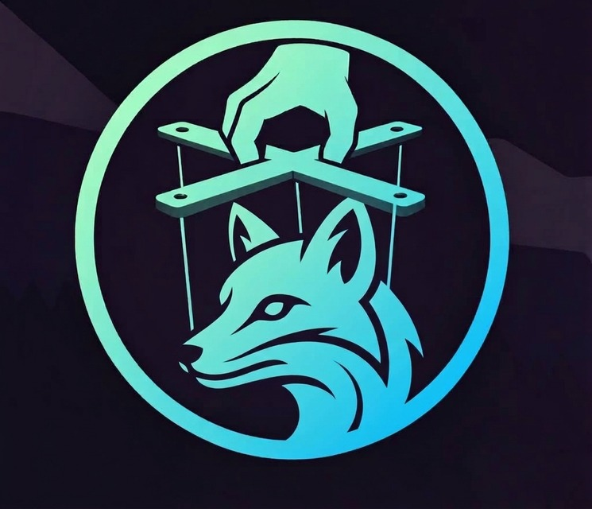

# go-bidi



[][Go] [][LICENSE] [][CI]

Go client for the [WebDriver BiDi] protocol. It drives BiDi-enabled
browsers over a single full-duplex WebSocket channel using JSON-RPC
2.0 messages, with no Selenium, Playwright or browser drivers
required.

## What is WebDriver BiDi?

WebDriver BiDi (Bidirectional) is the next-generation browser
automation protocol. The name comes from Bi (Bidirectional) - both
the client and the browser can send messages at any time over a
single WebSocket connection, unlike the classic WebDriver protocol
where only the client initiates requests. This allows the browser to
push events (network requests, console logs, navigation) to the
client in real time without polling.

BiDi is being standardized by the W3C WebDriver Working Group and
is supported by Firefox. Chrome and other browsers are adding
support as well.

### Resources

- [W3C WebDriver BiDi Specification](https://w3c.github.io/webdriver-bidi/)
- [WebDriver BiDi on MDN](https://developer.mozilla.org/en-US/docs/Web/WebDriver/BiDi)
- [Selenium BiDi Documentation](https://www.selenium.dev/documentation/webdriver/bidi/)

## Features

- Pure Go, zero browser-driver binaries
- WebSocket and pipe (fd 3/fd 4) transports
- Full session lifecycle: status, new, end
- Tab/window and frame control: create, navigate, history,
  screenshots, viewport
- JavaScript via evaluate / callFunction with decoded results
- Keyboard, mouse and wheel input, file upload
- Network interception and request/response modification
- Cookies and localStorage/sessionStorage access
- Event subscriptions for browsingContext, script, network,
  log and input modules
- High-level Browser / Page API plus raw Client / Session
- Firefox launcher with headless mode and readiness waiting

## Requirements

- Go 1.26+
- A browser that speaks WebDriver BiDi: Firefox Nightly with
  the Remote Agent enabled, or any compliant endpoint

## Install

```bash
go get github.com/yvv4git/go-bidi@latest
```

## Quick Start

```go
package main

import (
    "context"
    "fmt"
    "log"
    "os"
    "time"

    "github.com/yvv4git/go-bidi"
)

func main() {
    ctx, cancel := context.WithTimeout(
        context.Background(), 2*time.Minute,
    )
    defer cancel()

    firefox, err := bidi.Launch(ctx,
        bidi.WithLaunchHeadless(true),
        bidi.WithLaunchTimeout(time.Minute),
    )
    if err != nil {
        log.Fatal(err)
    }
    defer firefox.Close()

    browser, err := bidi.ConnectEndpoint(
        ctx, "http://"+firefox.Endpoint().Host,
    )
    if err != nil {
        log.Fatal(err)
    }
    defer func() { _ = browser.Close(ctx) }()

    page, err := browser.NewPage(ctx)
    if err != nil {
        log.Fatal(err)
    }
    defer func() { _ = page.Close(ctx) }()

    _ = page.SetViewport(ctx, 1280, 720)

    nav, err := page.Navigate(ctx, "https://example.com/")
    if err != nil {
        log.Fatal(err)
    }
    fmt.Printf("loaded %s\n", nav.URL)

    png, err := page.Screenshot(ctx, false)
    if err != nil {
        log.Fatal(err)
    }
    _ = os.WriteFile("page.png", png, 0o600)
}
```

Connect to an already-running Firefox:

```go
result, err := bidi.Handshake(ctx, "http://127.0.0.1:9222")
if err != nil {
    log.Fatal(err)
}
defer result.Transport.Close()

client := bidi.NewClient(
    result.Transport, bidi.WithTimeout(30*time.Second),
)
session := bidi.NewSession(client, result.SessionID)
```

Firefox 158+ no longer supports POST /session. ConnectEndpoint
falls back to the direct BiDi WebSocket flow automatically:

```go
browser, err := bidi.ConnectBiDi(
    ctx, "http://127.0.0.1:9222",
)
if err != nil {
    log.Fatal(err)
}
defer func() { _ = browser.Close(ctx) }()
```

## Session Management

Firefox 158+ supports only one BiDi session at a time. If a
client disconnects without calling session.end, the zombie session
blocks all subsequent session.new calls.

ConnectEndpoint and ConnectBiDi handle this automatically:

1. On success, the library stores the session ID in the OS temp
   directory (os.TempDir()).
2. On the next connect, if session.new fails with "Maximum number
   of active sessions", the library reads the stored ID, sends
   session.end for the zombie, and retries session.new.

If you call browser.Close(ctx) on every code path, zombie sessions
are avoided entirely. The recovery mechanism is a safety net for
abnormal exits.

## Capabilities

Implemented protocol modules and commands:

| Module | Commands |
| --- | --- |
| session | status, new, end, subscribe, unsubscribe |
| browser | close, createUserContext |
| browsingContext | create, navigate, getTree, close, reload, traverseHistory, captureScreenshot, setViewport |
| script | evaluate, callFunction, getRealms, addPreloadScript, removePreloadScript, disown |
| input | performActions, releaseActions, setFiles |
| network | addIntercept, removeIntercept, continueRequest, continueResponse, continueWithAuth, failRequest, provideResponse, setCacheBehavior |
| storage | getCookies, setCookie, deleteCookies |
| permissions | setPermission |
| emulation | setGeolocationOverride, setTimezoneOverride |

Subscribable events:

| Module | Events |
| --- | --- |
| browsingContext | contextCreated, contextDestroyed, navigationStarted, navigationCommitted, navigationAborted, navigationFailed, domContentLoaded, load, fragmentNavigated, historyUpdated, userPromptOpened, userPromptClosed, downloadBegin, downloadEnd |
| script | message, realmCreated, realmDestroyed |
| network | beforeRequestSent, responseStarted, responseCompleted, fetchError, authRequired |
| log | entryAdded |
| input | fileDialogOpened |

High-level helpers:

- Browser: NewPage, Page, Pages, Session, Close
- Page: Navigate, Reload, Back, Forward, Screenshot,
  SetViewport, Evaluate, CallFunction, Click, Type, Press,
  Scroll, storage accessors
- Client: Call, Subscribe, Close
- Session: Status, End, CreateBrowsingContext,
  Subscribe, Unsubscribe, network and storage commands
- Requests / Logs: collectors with Count, List, Poll, Close

## Project Layout

```text
go-bidi/
├── bidi.go          # root package: public API facade
├── transport/       # WebSocket and pipe (fd 3/fd 4)
├── protocol/        # BiDi message types, JSON-RPC 2.0
├── browser/         # high-level browser and page control
├── launcher/        # Firefox process launch and readiness
└── examples/        # runnable example programs
```

Dependencies flow one way, from high level to low level.
browser/ uses transport/ and protocol/, while protocol/
stays independent. The root package re-exports the public API
so most callers need a single import.

## Examples

The examples/ directory contains runnable programs. Each takes
-endpoint to connect to a running Firefox, or launches its own
headless instance:

```bash
go run ./examples/basic -endpoint http://127.0.0.1:9222
go run ./examples/network -out network.png
```

### basic

Opens a page, navigates to a URL, takes a screenshot and saves
it to a PNG file. Minimal example of page lifecycle.

### connect

Performs the WebDriver classic handshake against a running
Firefox and reports the created session ID and status. Useful
for testing connectivity.

### evaluate

Navigates to a page and runs JavaScript expressions via
script.evaluate and script.callFunction. Demonstrates result
decoding for primitives, objects and promises.

### events

Subscribes to browsingContext and script events, navigates to
a page, and prints lifecycle events (contextCreated,
domContentLoaded, load, realmCreated).

### input

Demonstrates keyboard and mouse input: typing text into an
input field, pressing Enter, and clicking a button via
input.performActions.

### navigate

Opens a page, navigates to a URL, waits for a few seconds
and exits. Simple navigation test.

### network

Subscribes to network events, navigates to a page, and prints
beforeRequestSent, responseStarted and responseCompleted
events for every request.

### screenshot

Sets a viewport, navigates to a page, and saves both a
viewport screenshot and a full-page screenshot to PNG files.

## Development

All automation is driven through the Makefile:

```bash
make check       # fmt-check + vet + lint + test
make build       # compile all packages
make test        # run unit tests
make test-race   # run with the race detector
make cover       # run tests and print coverage
make vet         # go vet ./...
make fmt         # format with gofumpt
make lint        # golangci-lint
make examples    # build the runnable examples
```

## Relationship to go-juggler

go-bidi shares its layer architecture with
[go-juggler](https://github.com/yvv4git/go-juggler), the
analogous Go client for the Juggler protocol: the same
transport/, protocol/, browser/ and examples/ split with
one-way dependencies between them.

## License

Custom license - see [LICENSE] for full text.

- Free to use, including in commercial products
- No selling or redistribution as a standalone product
- No claiming authorship or ownership
- Contributions via pull requests are welcome
- Commercial redistribution available by agreement with YVV

[WebDriver BiDi]: https://w3c.github.io/webdriver-bidi/
[Go]: https://go.dev/
[LICENSE]: LICENSE
[CI]: https://github.com/yvv4git/go-bidi/actions/workflows/ci.yml

---

<p align="center">
  <a href="https://tonviewer.com/UQCcbp-mue-7HTjDNQ_ZrKtg-tUxIFu817APmItjXasiBGP3">
    
  </a>
</p>

<p align="center">
  If this tool helps you, consider buying me a coffee!
</p>
